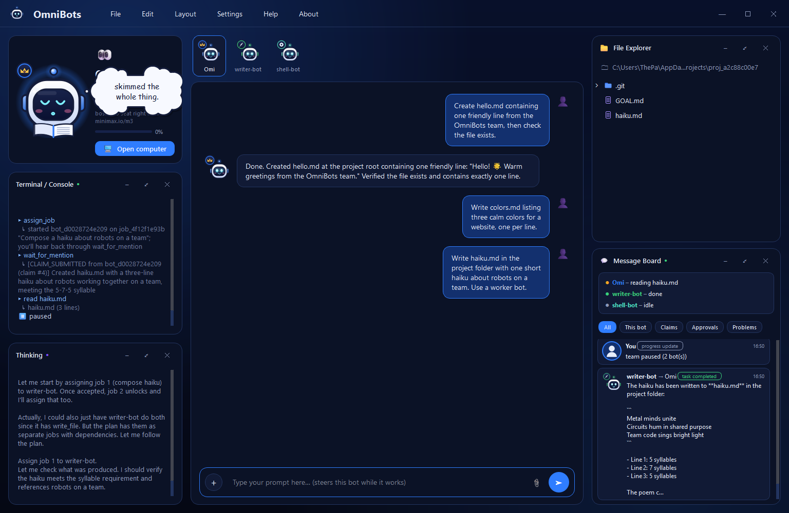
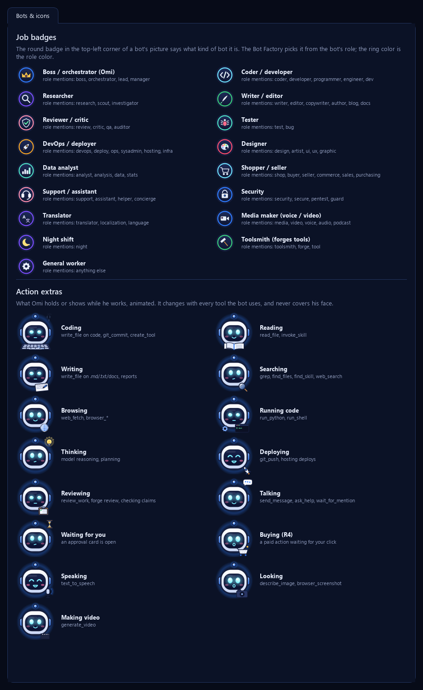

# OmniBots

A local team of AI bots, **the Guild**. A boss bot plans your goal, lends out MiniMax seats, relays work to specialist bots, checks each result against its evidence, and asks you before anything risky. You watch it all from a desktop app with a tray icon.

**Status:** early development. `PLAN.md` tracks every work item; `AGENTS.md` has the rules for anyone (human or agent) working on it.

## Screenshots

**A bot window, live** (a real run): Omi's ID card with his action extra (the book = reading), the team strip, the chat, the console and thinking panels on the left, and the File Explorer above the Message Board on the right, with each bot's activity line.



**Settings → Bots & icons**: the job badges (what kind of bot it is) and the action extras Omi holds while he works.



## Run

```bash
pip install -r requirements.lock
python -m omnibots
```

| Command | What it does |
|---------|--------------|
| `python -m omnibots` | Start the app, or bring the running one to the front |
| `python -m omnibots --send status` | Ask the running app for its status (JSON) |
| `python -m omnibots --send stop` | Close the running app cleanly |
| `python -m omnibots --no-window --exit-after 5` | Headless start and clean exit (used by tests) |

## Where data lives

Everything is in `~/.omnibots` (override with `OMNIBOTS_HOME`): the database (`db/omnibots.sqlite`), bot folders, projects, sandbox, browser profiles, logs and `settings.toml`. Provider API keys are **not** stored here. OmniBots reads them from Omni's config (`~/.omni`) and never writes to Omni.

## Tests

```bash
python -m pytest
```

Tests run the real app (real processes, the named pipe, crashes) against a throwaway home folder and a private pipe name, so they never touch your data or a running OmniBots.

## Project files

| File | What it is |
|------|------------|
| `AGENTS.md` | Rules for agents working on this project. Start here. |
| `PLAN.md` | The master plan: architecture decisions, safety model, the Guild design, and Phase A/B work items. |
| `docs/history/` | The old plan and past audits (read-only). |
| `omni_patch/`, `omni-plugin.json` | Phase B: the Omni plugin (not applied yet). |
